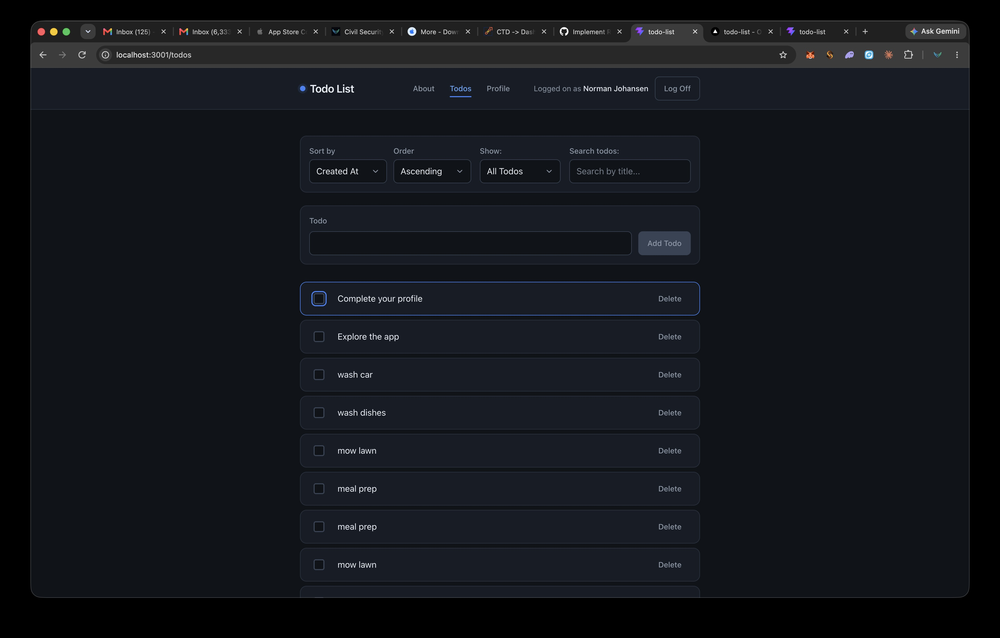
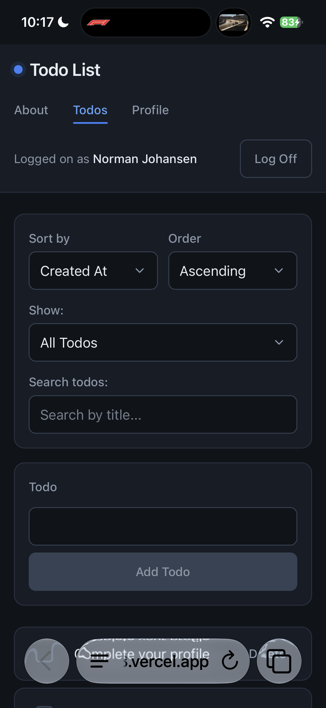

# Todo List

A full-stack todo application built as the capstone project for Code the Dream's React v4 course. Users sign in with an email and password, then create, edit, complete, and delete todos that persist to their account. The list can be sorted, searched, and filtered by status, and every change is reflected instantly in the UI before the server confirms it.

**Live demo:** [todo-list-rho-nine-68.vercel.app](https://todo-list-rho-nine-68.vercel.app)

**Repository:** [github.com/namidigital/todo-list](https://github.com/namidigital/todo-list)

## Screenshots



*Desktop: sort, filter, and search controls sit in a panel above the add form and list.*



*Mobile: the same view with controls stacked and touch-sized targets throughout.*

## Features

- **Authentication and protected routes.** Email/password login backed by a session cookie and CSRF token. The todos and profile pages redirect unauthenticated visitors to the login page and return them to their original destination afterward.
- **Full CRUD.** Create todos, edit titles inline, toggle completion in either direction, and delete with a confirmation prompt.
- **Completed items sink to the bottom.** A stable sort keeps active todos above completed ones without disturbing the server-provided order within each group.
- **Server-side sorting** by creation date or title, ascending or descending.
- **Debounced search** by title, so the API is queried once the user pauses typing rather than on every keystroke.
- **Status filtering** (all / active / completed) stored in the URL as a `?status=` query parameter, so a filtered view survives refresh and can be shared as a link.
- **Optimistic updates with rollback.** Every mutation updates the list immediately; if the request fails, the previous state is restored (including a deleted todo's original position) and a user-facing error is shown.
- **Profile page** with account details and todo statistics: total, completed, active, and completion percentage.
- **Responsive dark theme.** Mobile-first layout, WCAG AA contrast, visible keyboard focus indicators, and 44px minimum touch targets.

## Technologies

| Area | Choice |
|---|---|
| UI | React 19 |
| Routing | React Router 8 |
| Build tool | Vite |
| Styling | CSS Modules with design tokens as CSS custom properties |
| State | `useReducer` for todo state, Context API for authentication |
| Linting | ESLint with `react-hooks` and `react-refresh` plugins |
| Backend | REST API provided by Code the Dream |

## Getting Started

### Prerequisites

- Node.js 18 or later
- npm

### Installation

```bash
git clone https://github.com/namidigital/todo-list.git
cd todo-list
npm install
```

### Environment

The dev server proxies `/api/*` requests to the backend so the browser sees a single origin. Copy the example file to create your local config:

```bash
cp .env.example .env
```

This sets `VITE_TARGET`, the URL the Vite dev proxy forwards API requests to. It is read only by `vite.config.js` and never reaches the client bundle.

### Running

```bash
npm run dev
```

The app is served at [http://localhost:3001](http://localhost:3001).

## Available Scripts

| Script | What it does |
|---|---|
| `npm run dev` | Starts the Vite dev server on port 3001 with hot module replacement and the `/api` proxy. |
| `npm run build` | Produces an optimized production build in `dist/`. |
| `npm run preview` | Serves the production build locally to verify it before deploying. |
| `npm run lint` | Runs ESLint across the project. |

## Project Structure

```
src/
├── pages/          Route-level components: Login, Todos, Profile, About, NotFound, Home
├── features/       Feature modules with their own components and styles
│   ├── Logoff.jsx
│   └── Todos/      TodoForm, TodoList, TodoListItem
├── shared/         Reusable UI: Header, Navigation, form controls, shared control styles
├── contexts/       AuthContext — login/logout and the current session
├── reducers/       todoReducer — todo list state and action types
├── components/     RequireAuth route guard
├── utils/          Validation, error-message mapping, useDebounce
├── App.jsx         Route table and app shell
├── App.css         App-level layout
└── index.css       Reset, design tokens, and base element styles
```

Each component that needs styling has a `.module.css` file beside it. Shared control primitives (inputs, selects, buttons) live in `shared/controls.module.css` and are pulled into component modules with `composes`.

## Design Decisions

**CSS Modules.** Class names are scoped to the component that declares them, so two components can each have a `.title` without colliding. Vite supports CSS Modules natively, so there is no runtime library or build plugin to add, and the files are plain CSS rather than a JavaScript DSL.

**Design tokens in `index.css`.** Colors, spacing, type scale, radii, and transition timings are defined once as CSS custom properties on `:root`. Component modules reference the tokens rather than hardcoding values, so the palette or spacing rhythm can be changed in one place and every component follows.

**Dark theme with blue accents.** The dark palette is a deliberate choice rather than a default, and every color pairing was checked against WCAG AA. Body text on the background measures roughly 15:1 and muted text about 6.3:1. The primary button fill uses `#2563eb` rather than the lighter `#3b82f6` used elsewhere as the accent, specifically because white label text on the lighter blue falls short of the 4.5:1 threshold while the darker fill clears it.

**Mobile-first responsive layout.** Base styles target small screens; `min-width` media queries enhance the layout for tablet and desktop. Every interactive element meets a 44px minimum touch target, and the page never scrolls horizontally at any width.

**`useReducer` for todo state.** The todos page coordinates eight related pieces of state: the list, two error channels, a loading flag, sort field and direction, a search term, and a data version. Managing them through one reducer with a fixed set of actions keeps transitions predictable, and it made the optimistic-update-with-rollback pattern uniform: each operation dispatches a `START` action that updates the list immediately, then `SUCCESS` or `ERROR`, where `ERROR` restores the captured original state.

**Context for authentication.** Session state (email, CSRF token, `isAuthenticated`) and the `login`/`logout` functions are needed by the header, the navigation, the route guard, and several pages. Providing them through `AuthContext` removed prop drilling through four component levels.

## Security Considerations

- **Client-side validation with length limits.** Todo titles are capped at 200 characters, email at 254 (per RFC 5321), and password at 128. Inputs carry `maxLength` as a hard stop, and a validation layer explains why a submission was rejected (empty, whitespace-only, over the limit, or malformed email) rather than silently disabling the button.
- **Error messages that don't leak internals.** Failed requests are mapped to user-facing messages that say what happened and what to do next. Status codes, endpoint paths, server response bodies, and stack traces never reach the UI. An expired session (401) is reported as "Your session has expired. Please log in again."
- **Dev-only technical logging.** The underlying error, including HTTP status and server message, is logged to the console behind an `import.meta.env.DEV` guard. Vite eliminates those branches from the production bundle.
- **No secrets in the client bundle.** `.env` is gitignored and the only variable it holds is the dev proxy target, which is consumed in `vite.config.js` and does not appear in built assets.
- **CSRF token on state-changing requests.** The token returned at login is sent as an `X-CSRF-TOKEN` header on every `POST`, `PATCH`, and `DELETE`, alongside the session cookie.
- **Masked password field.** The password input uses `type="password"` with `autoComplete="current-password"` so browsers and password managers handle it correctly.

## Deployment

The app is deployed on [Vercel](https://vercel.com) from the `main` branch. In production, `vercel.json` rewrites `/api/*` to the backend API, so the browser continues to talk to a single origin. This replaces the Vite dev proxy, which serves the same purpose locally; the application code is identical in both environments.

## Future Improvements

- Drag-and-drop reordering of todos
- Due dates and priority levels
- A dark/light theme toggle that respects the system preference
- Unit and component tests with Vitest and React Testing Library
- Offline support with a service worker and queued mutations

## License

This project is licensed under the MIT License. See [LICENSE](./LICENSE) for details.

## Contact

[github.com/namidigital](https://github.com/namidigital)
